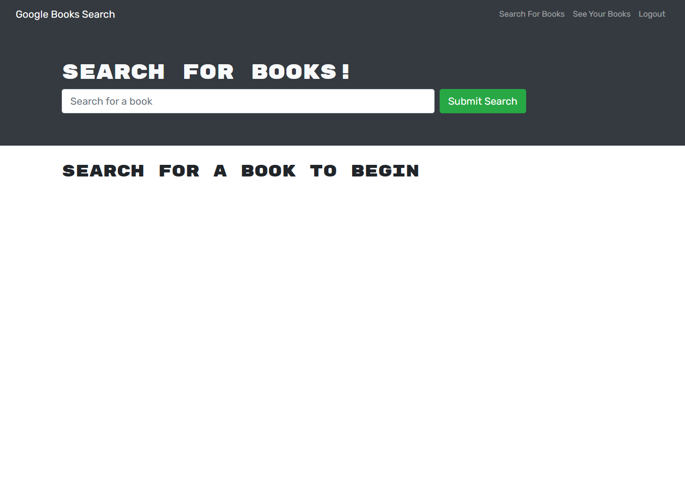

# Book-Search-Engine

## Description
Refactored a Google Books API search engine built with a RESTful API into a GraphQL API built with Apollo Server. App uses the MERN stack: React front end, MongoDB databse, and Node/Express server and API. 

## Deployed App
[Heroku App] (https://book-search-app-bootcamp.herokuapp.com/)

## Table of Contents
- [Usage](#usage)
- [Screenshots](#screenshots)
- [Contributions](#contributions)
- [License](#license)
  
## Usage
Visit the url of the deployed app. Sign up or log in. Search for a book or keywords, and save books to your list. Then, view saved books with the link at the top. You can also delete any book from your saved books.
  
## Screenshots

## Contributions 
More than welcome to any suggestions or comments. Feel free to open a comment for Pull Requests.

## License 

Copyright (c) 2012-2022 Ethan Quinlan.

Permission is hereby granted, free of charge, to any person obtaining
a copy of this software and associated documentation files (the
"Software"), to deal in the Software without restriction, including
without limitation the rights to use, copy, modify, merge, publish,
distribute, sublicense, and/or sell copies of the Software, and to
permit persons to whom the Software is furnished to do so, subject to
the following conditions:

The above copyright notice and this permission notice shall be
included in all copies or substantial portions of the Software.

THE SOFTWARE IS PROVIDED "AS IS", WITHOUT WARRANTY OF ANY KIND,
EXPRESS OR IMPLIED, INCLUDING BUT NOT LIMITED TO THE WARRANTIES OF
MERCHANTABILITY, FITNESS FOR A PARTICULAR PURPOSE AND
NONINFRINGEMENT. IN NO EVENT SHALL THE AUTHORS OR COPYRIGHT HOLDERS BE
LIABLE FOR ANY CLAIM, DAMAGES OR OTHER LIABILITY, WHETHER IN AN ACTION
OF CONTRACT, TORT OR OTHERWISE, ARISING FROM, OUT OF OR IN CONNECTION
WITH THE SOFTWARE OR THE USE OR OTHER DEALINGS IN THE SOFTWARE.